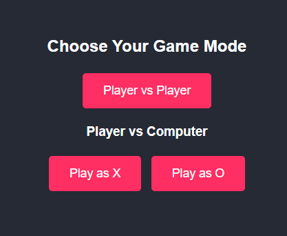
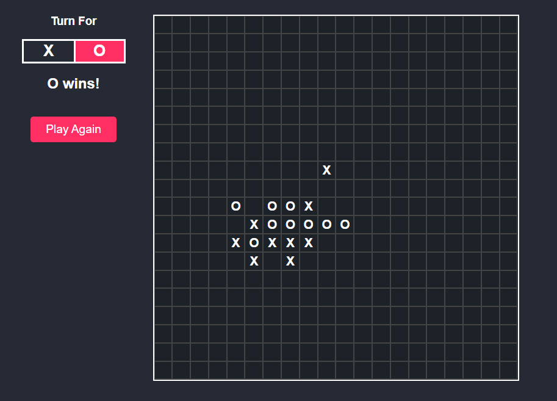

<details>
<summary><strong>Tiếng Việt (Vietnamese)</strong></summary>

# Gomoku (Cờ Caro) - Player vs AI

Đây là một dự án game Gomoku (hay còn gọi là Cờ Caro) được xây dựng hoàn toàn bằng HTML, CSS và JavaScript thuần túy. Dự án này cho phép người chơi đấu với người khác trên cùng một máy (Player vs Player) hoặc thử sức với máy tính (Player vs Computer) với một AI được lập trình logic ưu tiên phòng thủ.

## Mục lục

- [Tính năng chính](#tính-năng-chính)
- [Demo](#demo)
- [Hình ảnh](#hình-ảnh)
- [Cách chạy dự án](#cách-chạy-dự-án)
- [Tùy chỉnh](#tùy-chỉnh)
- [Giải thích Logic AI](#giải-thích-logic-ai)
- [Cấu trúc Code](#cấu-trúc-code)
- [Bản quyền](#bản-quyền)

## Tính năng chính

- **Nhiều chế độ chơi**:
  - `Player vs Player`: Hai người chơi trên cùng một máy.
  - `Player vs Computer`: Người chơi đấu với máy.
- **Lựa chọn phe**: Khi chơi với máy, bạn có thể chọn đi trước (quân X) hoặc đi sau (quân O).
- **AI thông minh**: AI được lập trình với các quy tắc ưu tiên rõ ràng, tập trung vào phòng thủ trước khi tấn công.
- **Tùy chỉnh bàn cờ**: Dễ dàng thay đổi kích thước bàn cờ (ví dụ: 20x20, 40x40) chỉ bằng cách sửa một biến.
- **Giao diện sạch sẽ**: Giao diện người dùng trực quan, hiển thị rõ lượt đi và kết quả.
- **Đánh dấu đường thắng**: Khi có người thắng, 5 ô cờ chiến thắng sẽ được tô sáng.
- **Chơi lại nhanh**: Nút "Play Again" cho phép bắt đầu ván mới một cách nhanh chóng.

## Demo

Bạn có thể xem demo trực tiếp của sản phẩm tại đây:

**(Thay thế `your-demo-link` bằng link GitHub Pages hoặc Netlify của bạn)**
[🎮 Chơi ngay!](https://tranhuudat2004.github.io/Caro-Board/)

## Hình ảnh

*Màn hình chọn chế độ chơi*


*Giao diện ván đấu đang diễn ra*



## Cách chạy dự án

Dự án này không yêu cầu bất kỳ bước cài đặt phức tạp nào.

1.  Clone repository này về máy của bạn:
    ```bash
    git clone https://github.com/TranHuuDat2004/Caro-Board.git
    ```
2.  Mở thư mục dự án.
3.  Mở file `index.html` bằng trình duyệt web của bạn (ví dụ: Google Chrome, Firefox).

Vậy là xong, bạn có thể bắt đầu chơi!

## Tùy chỉnh

Bạn có thể dễ dàng thay đổi kích thước bàn cờ.

1.  **Trong file `style.css`**:
    Thay đổi giá trị của biến `--board-size`.
    ```css
    :root {
        --board-size: 20; /* BẠN CÓ THỂ THAY ĐỔI SỐ NÀY (VD: 40) */
    }
    ```
2.  **Trong file `script.js`**:
    Thay đổi giá trị của hằng số `BOARD_SIZE` sao cho **khớp với giá trị trong file CSS**.
    ```javascript
    const BOARD_SIZE = 20; // PHẢI GIỐNG VỚI GIÁ TRỊ TRONG CSS
    ```

## Giải thích Logic AI

AI trong game này không sử dụng thuật toán phức tạp như Minimax mà hoạt động dựa trên một bộ quy tắc ưu tiên để tìm ra nước đi tốt nhất. Thứ tự ưu tiên như sau:

1.  **Phòng thủ tuyệt đối (Chặn thắng)**:
    - AI sẽ giả lập nước đi của người chơi ở tất cả các ô trống.
    - Nếu có một nước đi nào đó giúp người chơi thắng ngay lập tức (tạo thành hàng 5 quân), AI sẽ **bắt buộc** phải đi vào ô đó để chặn. Đây là ưu tiên cao nhất.

2.  **Tấn công thắng ngay**:
    - Nếu không có mối đe dọa nào từ người chơi, AI sẽ kiểm tra xem nó có thể thắng ngay trong lượt này không.
    - Nếu có, nó sẽ đi vào ô đó để kết thúc ván cờ.

3.  **Phòng thủ sớm (Chặn mối đe dọa)**:
    - AI sẽ kiểm tra các mối đe dọa tiềm tàng từ người chơi, chẳng hạn như một hàng 3 hoặc 4 quân cờ chưa bị chặn.
    - Nó sẽ ưu tiên đi vào các vị trí để phá vỡ các chuỗi nguy hiểm này của người chơi.

4.  **Đi nước có tính chiến thuật**:
    - Nếu không có các trường hợp trên, AI sẽ tìm các ô trống nằm gần các quân cờ (của cả AI và người chơi) đã được đánh trên bàn.
    - Việc này giúp các nước đi của AI có tính liên kết hơn, thay vì đi một cách ngẫu nhiên.

5.  **Nước đi dự phòng**:
    - Trong trường hợp không có nước đi nào thỏa mãn các điều kiện trên (thường chỉ xảy ra ở đầu game), AI sẽ chọn một ô trống ngẫu nhiên để đi.

## Cấu trúc Code

-   `index.html`: Chứa cấu trúc DOM của trang web, bao gồm màn hình menu và khu vực chơi game.
-   `style.css`: Định dạng tất cả các yếu tố giao diện, từ màu sắc, bố cục (sử dụng CSS Grid), hiệu ứng cho đến kích thước bàn cờ.
-   `script.js`: Chứa toàn bộ logic của trò chơi.

## Bản quyền

Dự án này được cấp phép theo Giấy phép MIT.

</details>

<details>
<summary><strong>English</strong></summary>

# Gomoku (Caro) - Player vs AI

This is a Gomoku (also known as Caro) game project built entirely with vanilla HTML, CSS, and JavaScript. This project allows users to play against another person on the same machine (Player vs Player) or challenge a computer opponent (Player vs Computer) featuring a defense-oriented AI.

## Table of Contents

- [Key Features](#key-features)
- [Live Demo](#live-demo)
- [Screenshots](#screenshots)
- [How to Run](#how-to-run)
- [Customization](#customization)
- [AI Logic Explained](#ai-logic-explained)
- [Code Structure](#code-structure)
- [License](#license)

## Key Features

- **Multiple Game Modes**:
  - `Player vs Player`: Two players on the same machine.
  - `Player vs Computer`: A player challenges the AI.
- **Side Selection**: When playing against the computer, you can choose to play as X (first move) or O (second move).
- **Intelligent AI**: The AI is programmed with a clear set of priorities, focusing on defense before offense.
- **Customizable Board**: Easily change the board size (e.g., 20x20, 40x40) by modifying a single variable.
- **Clean UI**: An intuitive user interface that clearly displays whose turn it is and the game's outcome.
- **Winning Line Highlight**: When a player wins, the five winning cells are highlighted.
- **Quick Rematch**: The "Play Again" button allows for a new game to be started instantly.

## Live Demo

You can try the live demo of the project here:

**(Replace `your-demo-link` with your actual GitHub Pages or Netlify link)**
[🎮 Play Now!](https://tranhuudat2004.github.io/Caro-Board/)

## Screenshots

*Game Mode Selection Screen*


*In-Game Interface*


## How to Run

This project does not require any complex installation steps.

1.  Clone this repository to your local machine:
    ```bash
    git clone https://github.com/TranHuuDat2004/Caro-Board.git
    ```
2.  Navigate to the project directory.
3.  Open the `index.html` file in your web browser (e.g., Google Chrome, Firefox).

That's it, you can start playing!

## Customization

You can easily change the size of the game board.

1.  **In `style.css`**:
    Change the value of the `--board-size` variable.
    ```css
    :root {
        --board-size: 20; /* YOU CAN CHANGE THIS NUMBER (e.g., 40) */
    }
    ```
2.  **In `script.js`**:
    Change the value of the `BOARD_SIZE` constant to **match the value in the CSS file**.
    ```javascript
    const BOARD_SIZE = 20; // MUST MATCH THE VALUE IN CSS
    ```

## AI Logic Explained

The AI in this game does not use complex algorithms like Minimax. Instead, it operates on a set of prioritized rules to determine the best move. The order of priority is as follows:

1.  **Absolute Defense (Block Immediate Win)**:
    - The AI simulates the player's next move in all empty cells.
    - If any move would result in an immediate win for the player (creating a line of 5), the AI is **forced** to play in that cell to block. This is the highest priority.

2.  **Offensive Win**:
    - If there are no immediate threats from the player, the AI checks if it can win on its current turn.
    - If so, it will play the winning move to end the game.

3.  **Early Defense (Block Threats)**:
    - The AI checks for potential threats from the player, such as an open-ended line of 3 or 4 pieces.
    - It will prioritize moves that disrupt these dangerous formations.

4.  **Strategic Move**:
    - If none of the above conditions are met, the AI will find empty cells that are adjacent to any existing pieces (both AI's and player's).
    - This helps the AI's moves to be more cohesive rather than placed randomly in a meaningless location.

5.  **Fallback Move**:
    - In the event that no move satisfies the above criteria (usually only at the very beginning of the game), the AI will choose a random empty cell.

## Code Structure

-   `index.html`: Contains the DOM structure of the web page, including the menu screen and the game area.
-   `style.css`: Styles all UI elements, from colors and layout (using CSS Grid) to effects and board dimensions.
-   `script.js`: Contains all the game's logic.

## License

This project is licensed under the MIT License.

</details>